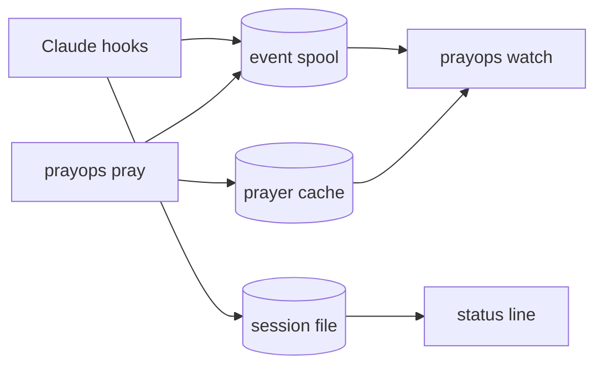

# PrayOps Terminal for Claude Code

> DevOps 이후의 마지막 단계.

Claude Code 상태줄에 향로가 놓입니다. 일하는 동안 향이 타고 연기가 오르며, 기도를 올리면 향로 주변에 기도가 잔뜩 뿌려졌다가 사그라듭니다.

```text
⠀⠀⠀⠀⠀░ ▒ ░
⠀⠀⠀⠀⠀▒ ▒ ▒
⠀⠀⠀⠀⠀▪ ▪ ▪
⠀⠀⠀⠀⠀▮ ▮ ▮
⠀⠀⠀⠀⠀▮ ▮ ▮
⠀⠀⠀⠀▗▄▄▄▄▄▖
⠀▗▄▟███████▙▄▖
⠀▝▀▜███████▛▀▘
⠀⠀⠀⠀▝▀▀▀▀▀▘
⠀⠀⠀⠀▝  ▀  ▘
PrayOps · IDLE
```

`/pray`를 올리면:

```text
⠀⠀⠀⠀⠀▒🙏 ░ 🙏
⠀⠀⠀⠀⠀▒🙏 ▒ 🙏     🙏
⠀⠀⠀🙏🙏▪ ▪🙏  🙏 🙏
⠀⠀⠀⠀⠀🙏▮🙏
⠀⠀⠀⠀⠀▮ ▮ ▮  🙏 🙏  🙏
⠀⠀⠀⠀🙏▄🙏▄▖🙏  🙏
⠀▗▄▟🙏█████🙏🙏🙏  🙏
⠀▝▀▜████🙏█▛▀▘
⠀⠀⠀⠀▝▀▀▀🙏🙏     🙏🙏
⠀⠀⠀⠀🙏 ▀  ▘       🙏
PrayOps · WORKING · 100%
```

별도 터미널을 열 필요가 없습니다. 설치하면 Claude Code 안에 바로 보입니다.

좁은 창에서는 마지막 한 줄로 물러납니다.

```text
WORKING 100%
```

## 설치

```text
/plugin marketplace add cruellaDev/claude-code-prayops
/plugin install prayops@prayops
/reload-plugins
```

끝입니다. 런타임은 플러그인 안에 들어 있고, 다음 세션이 시작될 때 SessionStart 훅이
이 플랫폼용 바이너리를 제자리에 복사합니다. 다운로드도, 승인도 없습니다.
**업데이트도 `/plugin update prayops@prayops` 하나로 끝납니다.**

상태줄에 향로를 띄우려면 한 번만:

```text
/prayops:setup
```

상태줄은 사용자 `settings.json`에만 쓸 수 있습니다 — Claude Code는 `statusLine`을
거기서만 읽고, 프로젝트의 `.claude/settings.json`에 넣은 것은 아무 말 없이 무시합니다.
그래서 "이 프로젝트에서만"은 설정이 아니라 런타임이 판단합니다:

```text
prayops statusline scope                 지금 어떤 규칙이 걸려 있는지
prayops statusline scope --only-here     이 프로젝트만
prayops statusline scope --not-here      이 프로젝트만 제외
prayops statusline scope --only-session  이 창만 (창을 닫으면 자동 해제)
prayops statusline scope --off / --on    잠깐 끄기 / 켜기
prayops statusline scope --everywhere    전부 해제 (기본값)
```

`--only-session`은 프로젝트보다 좁습니다. 같은 저장소를 두 창에서 열었을 때 한쪽만
켜는 건 이것으로만 됩니다. 창이 닫히면 SessionEnd 훅이 목록에서 지우므로, 죽은
세션이 향로를 계속 숨기는 일은 없습니다.

`--off`는 `uninstall`과 다릅니다. `uninstall`은 `settings.json`에서 설정 자체를
지우고 이전 상태로 되돌리지만, `--off`는 설정과 위 선택을 남긴 채 그리지만
않습니다. 껐다 켜면 원래 범위로 돌아옵니다.

### 그림 고르기

두 가지 중에 고를 수 있습니다.

```text
prayops statusline theme censer   향로 (기본값)
prayops statusline theme lamp     램프
prayops statusline theme holder   인센스 스틱 홀더
prayops statusline theme          지금 어느 것인지
```

**향로**는 턴이 성공으로 끝나면 환한 빛이 바깥으로 퍼지고, 실패하면 어두운 그늘이 향로 곁에 내려앉습니다.

**램프**는 주둥이에서 연기가 오릅니다. 턴이 성공으로 끝나면 빨간 하트가 피어오르고,
실패하면 폭죽이 팡 터집니다.

**인센스 스틱 홀더**는 장식이 아니라 **보고**입니다. 스틱 길이가 곧 진행률이라, 턴이
오래 걸릴수록 향이 짧아지고 재가 쌓입니다. 타는 끝은 빨갛고, 연기는 그 지점을 따라
왼쪽으로 옮겨 갑니다.

세 테마 다 `/pray`로 직접 부르면 **70% 확률**로 성공/실패가 갈립니다. 턴이 끝나서
저절로 터진 것은 확률이 아니라 진짜 결과입니다.

```text
⠀⠀⠀⠀⠀⠀⠀⠀⠀⠀⠀⠀⠀⠀⠀⠀⠀⠀⠀⠀⠀⠀⠀▒ ▒ ░
⠀⠀⠀⠀⠀⠀⠀⠀⠀⠀⠀⠀⠀⠀⠀⠀⠀⠀⠀⠀⠀⠀⠀⠀▒ ▒
⠀⠀⠀⠀⠀⠀⠀⠀⠀⠀⠀⠀⠀⠀⠀⠀⠀⠀⠀⠀⠀⠀⠀⠀⠀▒
⠀⠀⠀⠀⠀⠀⠀⠀⠀⠀▄
⠀⠀⠀⠀⠀⠀⠀⠀⠀███
⠀▗▄▖   ▗███████▖▄▄▄▄▄▄▄▄▄▄▖
⠀▐ ▌  ▟████████████████▛▀▘
⠀⠀▀   ▜██████████▛▀▀▀▘
⠀⠀⠀⠀⠀⠀⠀⠀▝▀█████▀▘
⠀⠀⠀⠀⠀⠀⠀⠀▄▄▄███▄▄▄
PrayOps · WORKING · 100%
```

상태줄 없이도 `/prayops:pray`는 대화창에 그려 줍니다.

## 사용

### 기도

```text
/prayops:pray
/prayops:pray 무사배포
/prayops:pray --image ./wish.png
```

기도 이모지가 향로 주변에 뿌려졌다가 5초에 걸쳐 사그라듭니다. 인자가 없으면 기본 preset이 올라갑니다. 이미지는 **직접 경로를 지정한 파일만** 읽습니다 — 자동으로 찾지 않습니다.

`/pray` 별칭은 선택입니다. 이미 다른 스킬이 `/pray`를 쓰고 있으면 설치를 거부하고 그 파일을 건드리지 않습니다.

### 큰 화면 (선택)

향로는 상태줄에 이미 보입니다. 더 큰 화면에서 이미지 dissolve까지 보고 싶으면:

```bash
"<plugin-data>/bin/prayops" watch
```

별도 터미널이나 tmux pane에서 실행합니다. `/prayops:watch`가 정확한 경로를 알려줍니다. Claude Code의 Bash 도구 안에서는 실행하지 않습니다 — 세션 내내 도구를 붙잡고 있게 됩니다.

`q` · `esc` · `ctrl+c`로 종료하며 터미널은 복원됩니다.

### 진단

```text
/prayops:doctor
```

```text
Binary       OK    darwin/arm64
Plugin       OK    0.5.0
Runtime      OK    0.5.0
Version      OK    0.5.0
State        OK    3 pending
Hooks        OK    last event just now
Status line  OK    installed by PrayOps
Alias /pray  OK    not installed
Watcher      OK    not running
Terminal     OK    truecolor
```

## 개인정보

저장하는 것:

| 항목 | 예 |
|---|---|
| session id | `s1` |
| 이벤트 종류 | `TOOL_STARTED` |
| 작업 디렉터리 **해시** | `f59d2bfb2a034701` |
| 프로젝트 이름 | `payment-api` |
| 도구 **분류** | `execute` |
| 시각 | `2026-08-04T07:00:00Z` |

저장하지 않는 것: 프롬프트, 코드, 명령어, tool input, tool output, 오류 메시지, transcript 경로, 어시스턴트 메시지, 원본 작업 디렉터리 경로, 원본 이미지 파일.

도구 이름도 분류로만 남습니다. MCP 서버 이름이 내부 시스템을 드러낼 수 있기 때문입니다.

이 약속은 문서가 아니라 테스트로 지킵니다. `internal/privacy`가 실제 바이너리에 위 항목이 전부 담긴 hook payload를 흘려보낸 뒤, 플러그인 data 디렉터리에 남은 **모든 바이트**를 읽어 검사합니다.

네트워크를 전혀 쓰지 않습니다. 런타임은 플러그인과 함께 배포되고 설치는 복사입니다. 설치된 바이너리에는 HTTP 클라이언트가 링크조차 되어 있지 않으며, 이것도 테스트가 검사합니다. 텔레메트리는 없습니다.

## 지원 플랫폼

| 플랫폼 | 상태 |
|---|---|
| macOS arm64 · amd64 | 지원. 바이너리가 플러그인에 함께 배포됩니다 |
| Linux amd64 · arm64 | 지원. 바이너리가 플러그인에 함께 배포됩니다 |
| WSL2 | linux로 처리됩니다. 실기기 검증은 아직입니다 |
| native Windows | 미지원 |

## 문제가 생기면

| 증상 | 확인 |
|---|---|
| 상태줄이 안 보임 | `prayops statusline status`로 설치 여부를, `prayops statusline scope`로 이 프로젝트가 범위에 있는지 확인 |
| 상태줄이 `IDLE`에서 안 바뀜 | `/prayops:doctor`의 `Hooks` 줄. 이벤트가 기록되지 않으면 원인이 표시됩니다 |
| `prayops watch`가 TTY 오류 | 파이프나 Claude Code Bash 도구가 아닌 실제 터미널에서 실행해야 합니다 |
| 향로가 안 보이는데 오류도 없음 | `prayops statusline scope`. `--only-session`이나 `--only-here`로 좁혀 둔 상태일 수 있습니다 |
| 플러그인 업데이트 후 버전 불일치 | 새 세션을 시작하면 SessionStart 훅이 런타임을 갱신합니다 |
| 향로 줄이 왼쪽으로 밀려 보임 | 호스트가 앞 공백을 지운 것입니다. v0.5.0부터 지워지지 않는 문자로 채웁니다 |
| 향로 모양이 깨져 보임 | ambiguous width 문자를 2칸으로 렌더하는 터미널 설정일 수 있습니다 |
| 애니메이션을 원하지 않음 | `prayops watch --motion off` 또는 `NO_COLOR=1` |

상태줄과 `/pray` 별칭은 설치 전 원본을 백업하며, `uninstall`로 정확히 되돌립니다.

<details>
<summary>구조</summary>

```text
claude-code-prayops/
├─ .claude-plugin/marketplace.json   marketplace
├─ plugins/prayops/                  설치되는 plugin
│  ├─ skills/                        setup · pray · watch · doctor
│  ├─ hooks/hooks.json               lifecycle 9종, runtime 없으면 no-op
│  ├─ bin/prayops                    launcher
│  ├─ runtime/<os>_<arch>/prayops    함께 배포되는 런타임
│  ├─ scripts/ensure-runtime.sh      런타임을 제자리로 복사
│  └─ runtime-manifest.json
├─ cmd/prayops/                      Go runtime
├─ contracts/                        event · session · layout · raster
├─ internal/                         spool · hook · session · statusline ·
│                                    layout · render · smoke · effect ·
│                                    raster · prayer · watch · doctor ·
│                                    userconfig · bootstrap · privacy
└─ docs/                             제품·요구사항·아키텍처·결정
```

hook은 이벤트를 두 곳에 씁니다. 스풀은 watcher의 애니메이션용이고, 세션 파일은 상태줄용입니다. 스풀은 소비형이라 상태줄이 읽으면 watcher가 굶기 때문이며, hook이 항상 실행이 보장된 유일한 쓰기 주체이기 때문입니다.



</details>

## 문서

| 문서 | 내용 |
|---|---|
| `AGENTS.md` | 구현 에이전트 비협상 규칙 |
| `docs/01_PRODUCT.md` | 제품 범위와 사용자 경험 |
| `docs/02_REQUIREMENTS.md` | 기능·비기능 요구사항 |
| `docs/03_ARCHITECTURE.md` | Core·plugin·spool·TUI 구조 |
| `docs/04_DISTRIBUTION.md` | Marketplace·plugin 배포 |
| `docs/05_RUNTIME_BOOTSTRAP.md` | 최초 설치·업데이트·검증 |
| `docs/06_PRAY_EFFECT.md` | 랜덤 위치·raster·dissolve |
| `docs/07_DESIGN.md` | 픽셀 TUI·상태줄·문구 |
| `docs/08_DEVELOPMENT.md` | Go·테스트·CI·R&R |
| `docs/09_CODEX_INTEGRATION.md` | 동일 Core의 Codex 보조 통합 |
| `docs/10_DECISIONS.md` | 확정 결정 |
| `docs/11_BACKLOG.md` | 구현 순서 |

## 개발

```bash
go test ./...
go test -race ./...
claude plugin validate .
claude plugin validate ./plugins/prayops --strict
```

CI는 macOS와 Linux 양쪽에서 돕니다. 두 플랫폼이 부트스트랩이 쓰는 도구(`sha256sum` vs `shasum`, GNU vs BSD tar)에서 갈리기 때문에 한쪽만으로는 증명되지 않습니다. 네 타깃 모두 교차 컴파일하고, GoReleaser 스냅샷으로 만든 아카이브 이름이 런타임 매니페스트와 맞는지도 검사합니다.

릴리즈 전 남은 수동 확인 항목은 `CHANGELOG.md`에 있습니다.

라이선스 MIT.
