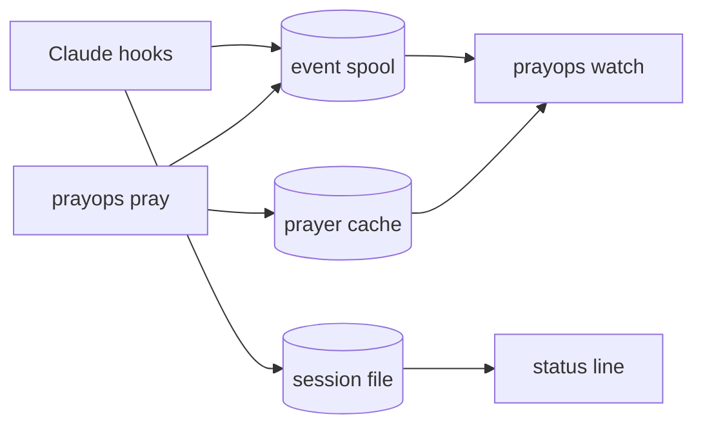

# PrayOps Terminal for Claude Code

> DevOps 이후의 마지막 단계.

Claude Code가 일하는 동안 향이 타고 연기가 오릅니다. 기도를 올리면 향로 옆에 나타났다가 픽셀 단위로 흩어집니다.

```text
╭────────────────────── PrayOps ───────────────────────╮
│                                                      │
│                         ~                            │
│         ╭──────────╮  ~                              │
│         │ 무사배포 │   ˙~ ~˙                         │
│         ╰──────────╯       .                         │
│                        ╹ ╹ ╹                         │
│                        │ │ │                         │
│                        │ │ │                         │
│                      ┌───────┐                       │
│                      │ ░░░░░ │                       │
│                      └───────┘                       │
│                (____)  (____)  (____)                │
│      ──────────────────────────────────────────      │
│                                                      │
│ WORKING · 정성을 들이고 있습니다                     │
│ Claude · payment-api                                 │
╰──────────────────────────────────────────────────────╯
```

Claude Code 하단에는 한 줄만 표시됩니다.

```text
祈 PrayOps · WORKING · 香 64%
```

## 설치

```text
/plugin marketplace add cruellaDev/claude-code-prayops
/plugin install prayops@prayops
/reload-plugins
```

그다음 한 번:

```text
/prayops:setup
```

플러그인 설치만으로는 아무것도 다운로드하지 않습니다. `/prayops:setup`이 **먼저 설치 계획을 보여주고**, 동의한 뒤에야 GitHub Releases에서 이 플랫폼용 바이너리 하나를 받아 SHA-256을 검증하고 설치합니다.

```text
PrayOps runtime

  Action    Installing v0.1.0
  Platform  darwin/arm64
  Source    https://github.com/cruellaDev/claude-code-prayops/releases/download/v0.1.0
  Asset     prayops_0.1.0_darwin_arm64.tar.gz
  Verify    SHA-256 against checksums.txt
  Install   ~/.claude/plugins/data/prayops-prayops/bin/prayops
```

## 사용

### 기도

```text
/prayops:pray
/prayops:pray 무사배포
/prayops:pray --image ./wish.png
```

인자가 없으면 기본 preset이 올라갑니다. 이미지는 **직접 경로를 지정한 파일만** 읽습니다 — 자동으로 찾지 않습니다.

`/pray` 별칭은 선택입니다. 이미 다른 스킬이 `/pray`를 쓰고 있으면 설치를 거부하고 그 파일을 건드리지 않습니다.

### 제단

```bash
"<plugin-data>/bin/prayops" watch
```

별도 터미널이나 tmux pane에서 실행합니다. `/prayops:watch`가 정확한 경로를 알려줍니다. Claude Code의 Bash 도구 안에서는 실행하지 않습니다 — 세션 내내 도구를 붙잡고 있게 됩니다.

`q` · `esc` · `ctrl+c`로 종료하며 터미널은 복원됩니다.

### 진단

```text
/prayops:doctor
```

```text
Plugin       OK    0.1.0
Runtime      OK    0.1.0
Version      OK    0.1.0
State        OK    3 pending
Hooks        OK    last event just now
Status line  OK    installed by PrayOps
Alias /pray  OK    not installed
Watcher      OK    running
Terminal     OK    truecolor
```

## 개인정보

저장하는 것:

| 항목 | 예 |
|---|---|
| session id | `s1` |
| 이벤트 종류 | `TOOL_STARTED` |
| 작업 디렉터리 **해시** | `f59d2bfb2a034701` |
| 프로젝트 이름 | `payment-api` |
| 도구 **분류** | `execute` |
| 시각 | `2026-08-04T07:00:00Z` |

저장하지 않는 것: 프롬프트, 코드, 명령어, tool input, tool output, 오류 메시지, transcript 경로, 어시스턴트 메시지, 원본 작업 디렉터리 경로, 원본 이미지 파일.

도구 이름도 분류로만 남습니다. MCP 서버 이름이 내부 시스템을 드러낼 수 있기 때문입니다.

이 약속은 문서가 아니라 테스트로 지킵니다. `internal/privacy`가 실제 바이너리에 위 항목이 전부 담긴 hook payload를 흘려보낸 뒤, 플러그인 data 디렉터리에 남은 **모든 바이트**를 읽어 검사합니다.

네트워크는 런타임 설치·업데이트 때 GitHub Releases에만 사용합니다. 설치된 바이너리에는 HTTP 클라이언트가 링크조차 되어 있지 않으며, 이것도 테스트가 검사합니다. 텔레메트리는 없습니다.

## 지원 플랫폼

| 플랫폼 | 상태 |
|---|---|
| macOS arm64 · amd64 | v0.1 |
| Linux amd64 · arm64 | v0.1 |
| WSL2 | v0.1 (linux로 처리) |
| native Windows | v0.2 예정 |

## 문제가 생기면

| 증상 | 확인 |
|---|---|
| 상태줄이 안 보임 | `/prayops:setup`에서 상태줄 설치에 동의했는지. `prayops statusline status`로 확인 |
| 상태줄이 `IDLE`에서 안 바뀜 | `/prayops:doctor`의 `Hooks` 줄. 이벤트가 기록되지 않으면 원인이 표시됩니다 |
| `prayops watch`가 TTY 오류 | 파이프나 Claude Code Bash 도구가 아닌 실제 터미널에서 실행해야 합니다 |
| 설치가 checksum 불일치로 실패 | 아무것도 설치되지 않았고 기존 런타임도 그대로입니다. 재시도하거나 릴리즈 페이지를 확인하세요 |
| 플러그인 업데이트 후 버전 불일치 | `/prayops:setup`을 다시 실행하면 런타임을 갱신합니다 |
| 제단 테두리가 깨져 보임 | ambiguous width 문자를 2칸으로 렌더하는 터미널 설정일 수 있습니다 |
| 애니메이션을 원하지 않음 | `prayops watch --motion off` 또는 `NO_COLOR=1` |

상태줄과 `/pray` 별칭은 설치 전 원본을 백업하며, `uninstall`로 정확히 되돌립니다.

<details>
<summary>구조</summary>

```text
claude-code-prayops/
├─ .claude-plugin/marketplace.json   marketplace
├─ plugins/prayops/                  설치되는 plugin
│  ├─ skills/                        setup · pray · watch · doctor
│  ├─ hooks/hooks.json               lifecycle 9종, runtime 없으면 no-op
│  ├─ bin/prayops                    launcher
│  ├─ scripts/setup.sh               bootstrap
│  └─ runtime-manifest.json
├─ cmd/prayops/                      Go runtime
├─ contracts/                        event · session · layout · raster
├─ internal/                         spool · hook · session · statusline ·
│                                    layout · render · smoke · effect ·
│                                    raster · prayer · watch · doctor ·
│                                    userconfig · bootstrap · privacy
└─ docs/                             제품·요구사항·아키텍처·결정
```

hook은 이벤트를 두 곳에 씁니다. 스풀은 watcher의 애니메이션용이고, 세션 파일은 상태줄용입니다. 스풀은 소비형이라 상태줄이 읽으면 watcher가 굶기 때문이며, hook이 항상 실행이 보장된 유일한 쓰기 주체이기 때문입니다.



</details>

## 문서

| 문서 | 내용 |
|---|---|
| `AGENTS.md` | 구현 에이전트 비협상 규칙 |
| `docs/01_PRODUCT.md` | 제품 범위와 사용자 경험 |
| `docs/02_REQUIREMENTS.md` | 기능·비기능 요구사항 |
| `docs/03_ARCHITECTURE.md` | Core·plugin·spool·TUI 구조 |
| `docs/04_DISTRIBUTION.md` | Marketplace·plugin 배포 |
| `docs/05_RUNTIME_BOOTSTRAP.md` | 최초 설치·업데이트·검증 |
| `docs/06_PRAY_EFFECT.md` | 랜덤 위치·raster·dissolve |
| `docs/07_DESIGN.md` | 픽셀 TUI·상태줄·문구 |
| `docs/08_DEVELOPMENT.md` | Go·테스트·CI·R&R |
| `docs/09_CODEX_INTEGRATION.md` | 동일 Core의 Codex 보조 통합 |
| `docs/10_DECISIONS.md` | 확정 결정 |
| `docs/11_BACKLOG.md` | 구현 순서 |

## 개발

```bash
go test ./...
go test -race ./...
claude plugin validate .
claude plugin validate ./plugins/prayops --strict
```

CI는 macOS와 Linux 양쪽에서 돕니다. 두 플랫폼이 부트스트랩이 쓰는 도구(`sha256sum` vs `shasum`, GNU vs BSD tar)에서 갈리기 때문에 한쪽만으로는 증명되지 않습니다. 네 타깃 모두 교차 컴파일하고, GoReleaser 스냅샷으로 만든 아카이브 이름이 런타임 매니페스트와 맞는지도 검사합니다.

릴리즈 전 남은 수동 확인 항목은 `CHANGELOG.md`에 있습니다.

라이선스 MIT.
