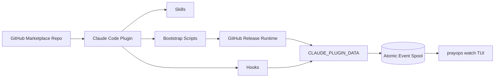

# PrayOps 아키텍처

## 1. 전체 구조



## 2. 저장소 역할

저장소는 세 역할을 함께 가진다.

1. Claude marketplace
2. PrayOps plugin source
3. Go runtime source·release

한 저장소를 쓰되 plugin cache 경계를 존중한다.

plugin은 `../cmd`처럼 plugin root 밖 source를 runtime에 참조하지 않는다.

## 3. Plugin root

```text
plugins/prayops/
├─ .claude-plugin/plugin.json
├─ skills/
├─ hooks/
├─ bin/
├─ scripts/
└─ runtime-manifest.json
```

Marketplace install 시 이 directory만 plugin cache로 복사된다.

## 4. Plugin data

```text
${CLAUDE_PLUGIN_DATA}/
├─ bin/
│  └─ prayops
├─ state/
│  ├─ events/
│  ├─ sessions/
│  └─ watchers/
├─ cache/
├─ backups/
├─ runtime.json
└─ install.json
```

plugin root는 immutable·ephemeral로 취급한다.

## 5. Bootstrap 경계

plugin bundled script가 하는 일:

- manifest 읽기
- OS/arch 감지
- 설치 정보 출력
- 사용자 확인
- asset 다운로드
- checksum 검증
- plugin data에 runtime 설치

bundled script가 하지 않는 일:

- full TUI 렌더
- lifecycle state 처리
- prompt parsing
- background daemon
- 자동 hook install

## 6. Launcher

### Skill launcher

plugin `bin/prayops`는 Bash tool PATH에 들어간다.

역할:

1. installed runtime 경로 확인
2. runtime 없으면 setup 안내 또는 interactive ensure
3. runtime 실행

### Hook launcher

hook은 plugin script를 호출한다.

```text
runtime 있음 → runtime hook claude
runtime 없음 → exit 0
```

Hook launcher는 다운로드하지 않는다.

## 7. Hook process

```text
Claude JSON stdin
→ max size
→ allowlist mapping
→ project hash
→ atomic event write
→ exit 0
```

Hook은 controlling TTY가 없다는 전제로 작성한다.

ANSI TUI를 hook에서 출력하지 않는다.

## 8. Event spool

```text
state/events/
├─ tmp/
├─ inbox/
└─ rejected/
```

Write:

```text
marshal
→ tmp write
→ close
→ rename inbox
```

Read:

```text
batch 64
→ validate
→ dedupe
→ reduce
→ delete
```

## 9. Session reducer

```text
SessionState + RitualEvent → SessionState
```

- PROMPT_SUBMITTED → THINKING
- TOOL_STARTED → WORKING
- TOOL_FINISHED → WORKING
- TOOL_FAILED → WORKING with tool error marker
- APPROVAL_REQUIRED → APPROVAL_REQUIRED
- TURN_COMPLETED → TURN_COMPLETED
- TURN_FAILED → TURN_FAILED
- SESSION_ENDED → SESSION_ENDED
- PRAYER_REQUESTED → queue append

## 10. TUI Core

```text
Bubble Tea Model
├─ session state
├─ layout
├─ incense
├─ smoke
├─ prayer queue
├─ active effect
└─ color profile
```

Domain 계산은 Bubble Tea update 함수에서 분리한다.

## 11. Status line

status line은 installed runtime을 absolute path로 실행한다.

Runtime:

- stdin JSON 전체 저장 금지
- cwd/project 식별에 필요한 최소 필드만 사용
- current local state 읽기
- compact text 출력
- 100ms 이내 목표

## 12. Full watch

`prayops watch`는 별도 terminal에서 실행한다.

Claude Code skill은 command만 안내한다.

tmux integration은 문서 예시이며 Core 의존성이 아니다.

## 13. Release

GoReleaser:

```text
tag
→ matrix build
→ archive
→ checksums.txt
→ GitHub Release
```

plugin manifest와 runtime manifest는 같은 release version을 가리킨다.

## 14. Codex

Codex integration은 `integrations/codex/`에 두며 Claude marketplace plugin에 포함하지 않는다.

Go Core와 event model을 재사용하지만 Claude plugin 출시 경로와 분리한다.
